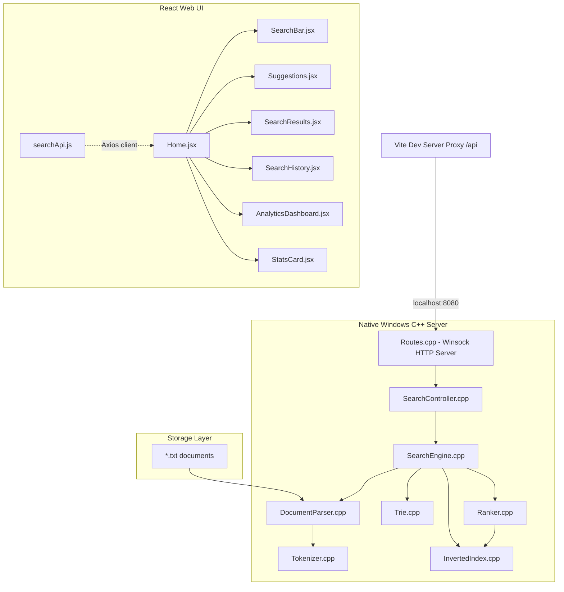

# Document Search Engine

A high-performance, full-stack document search engine featuring a native Windows C++ core and a modern React web interface. The system implements custom in-memory data structures (Trie and Inverted Index) to deliver lightning-fast word autocompletions and ranked document search results using the TF-IDF (Term Frequency-Inverse Document Frequency) algorithm.

---

## Table of Contents
1. [Project Overview](#project-overview)
2. [System Architecture](#system-architecture)
3. [Technology Analysis](#technology-analysis)
4. [Folder Structure Deep Analysis](#folder-structure-deep-analysis)
5. [Feature Analysis](#feature-analysis)
6. [Authentication & Authorization](#authentication--authorization)
7. [API Documentation](#api-documentation)
8. [Database Design](#database-design)
9. [Important Algorithms & Business Logic](#important-algorithms--business-logic)
10. [Security Analysis](#security-analysis)
11. [Performance Analysis](#performance-analysis)
12. [Production Readiness Assessment](#production-readiness-assessment)
13. [Technical Deep Dive](#technical-deep-dive)
14. [Future Improvements](#future-improvements)
15. [Getting Started](#getting-started)

---

## Project Overview

### What the Project Actually Does
This project indices text files (`*.txt`) contained within a target local folder, building an in-memory index structure of document terms. Once built, the backend starts a custom TCP/HTTP server that allows consumers to:
- Run query searches that return list of matching documents ranked by their statistical relevance.
- Fetch search autocomplete suggestions dynamically based on query character prefixes.
- Query real-time statistics regarding indexing time, unique terms count, average document length, memory footprint, and query latency.

### Problem it Solves
Standard database systems introduce massive overhead and configuration complexity for basic local full-text search systems. This lightweight application provides an embedded, self-contained, and dependency-free search server. By parsing files directly on disk, indexing them using custom data structures, and exposing endpoints over lightweight Winsock HTTP, it solves the problem of local desktop search or document indexing without dependencies on heavy search platforms (like Elasticsearch or Apache Solr).

### Target Users
- **Desktop/Local File Managers** looking for integrated local search utilities.
- **Embedded System Developers** needing lightweight document retrieval without external databases.
- **Computer Science Educators/Reviewers** looking for real-world implementations of data structures (Trie, Inverted Index, TF-IDF ranking).

### Real-World Workflow
1. The backend application runs and scans a local directory containing document text files (`*.txt`).
2. It parses each file, cleans and tokenizes the content, and populates the Trie and Inverted Index.
3. The backend starts listening for client HTTP requests on port `8080`.
4. The user launches the Vite-based React frontend.
5. As the user types in the search box, the client queries `/autocomplete` to show prefix recommendations.
6. When the user hits enter, the client queries `/search` to display matching documents sorted by TF-IDF scores, including a visual relevance breakdown bar.
7. Users can toggle Dark/Light mode and open an Analytics Dashboard to view total index statistics and performance metrics.

---

## System Architecture

The project follows a decoupled client-server architecture. The frontend is built on modern web-standards using React, and the backend is a native Windows application built in C++17.



### Frontend Architecture
The React application is a Single Page Application structured around a main [Home.jsx](file:///c:/Users/Satvik/OneDrive/Desktop/OneDrive/Documents/search-engine/frontend/src/pages/Home.jsx) container page. It manages state for the active query, list of matching document IDs, current suggestions, search history (cached in `localStorage`), theme config, and loading indicators. It delegates UI elements to isolated presentational components:
- [SearchBar.jsx](file:///c:/Users/Satvik/OneDrive/Desktop/OneDrive/Documents/search-engine/frontend/src/components/SearchBar.jsx): Handles text input, debounces autocomplete triggers, and tracks visual query execution times.
- [Suggestions.jsx](file:///c:/Users/Satvik/OneDrive/Desktop/OneDrive/Documents/search-engine/frontend/src/components/Suggestions.jsx): Renders prefix recommendations with keyboard navigation support.
- [SearchResults.jsx](file:///c:/Users/Satvik/OneDrive/Desktop/OneDrive/Documents/search-engine/frontend/src/components/SearchResults.jsx): Formats document matches and draws a gradient-filled visual score bar.
- [AnalyticsDashboard.jsx](file:///c:/Users/Satvik/OneDrive/Desktop/OneDrive/Documents/search-engine/frontend/src/components/AnalyticsDashboard.jsx): Visualizes index statistics (documents, unique words, size, average document lengths) and bar charts representing request latency.

### Backend Architecture
The backend is written in C++17. It avoids third-party web frameworks, relying entirely on raw Windows Socket API (Winsock2) to bind ports and process incoming HTTP streams.
- **Entry Point**: [main.cpp](file:///c:/Users/Satvik/OneDrive/Desktop/OneDrive/Documents/search-engine/backend/src/main.cpp) starts the execution, initializes the [SearchController](file:///c:/Users/Satvik/OneDrive/Desktop/OneDrive/Documents/search-engine/backend/src/api/SearchController.cpp), triggers directory indexing, and launches the HTTP socket server loop.
- **Server layer ([Routes.cpp](file:///c:/Users/Satvik/OneDrive/Desktop/OneDrive/Documents/search-engine/backend/src/api/Routes.cpp))**: Runs a blocking listener loop, receives raw TCP buffers, parses basic HTTP GET method strings, decodes URL characters, maps paths, and serializes response JSON manually.
- **Controller layer ([SearchController.cpp](file:///c:/Users/Satvik/OneDrive/Desktop/OneDrive/Documents/search-engine/backend/src/api/SearchController.cpp))**: Coordinates requests between the HTTP layer and the core search engine.
- **Engine layer ([SearchEngine.cpp](file:///c:/Users/Satvik/OneDrive/Desktop/OneDrive/Documents/search-engine/backend/src/engine/SearchEngine.cpp))**: Coordinates indexing of local documents, routes autocomplete prefixes to the `Trie`, intersects posting lists for multi-term query processing, and queries the `Ranker` for relevancy calculations.
- **Core Indexing Structures**:
  - [InvertedIndex.cpp](file:///c:/Users/Satvik/OneDrive/Desktop/OneDrive/Documents/search-engine/backend/src/engine/InvertedIndex.cpp): Maps cleaned terms to document identifier sets.
  - [Trie.cpp](file:///c:/Users/Satvik/OneDrive/Desktop/OneDrive/Documents/search-engine/backend/src/engine/Trie.cpp): Stores unique terms in a prefix tree to enable autocomplete suggestion extraction.
  - [Ranker.cpp](file:///c:/Users/Satvik/OneDrive/Desktop/OneDrive/Documents/search-engine/backend/src/engine/Ranker.cpp): Implements a custom Term Frequency-Inverse Document Frequency (TF-IDF) mathematical scoring engine.

### Database Architecture
*There is no database system (SQL or NoSQL) in this project.*
Data is loaded directly from flat files (`*.txt` files) located in `data/documents`. The parsed tokens, map tables, and trie nodes are stored in volatile heap memory for the duration of the server process. No serialization or persistence layer is configured.

### Authentication Architecture
*There is no authentication or authorization mechanism in this project.*
All endpoints are public and allow any client connected to the TCP port to execute searches, request autocomplete words, and query internal statistics.

---

## Technology Analysis

| Technology / Library | Why it is used | Where it is used | Impact if removed |
| :--- | :--- | :--- | :--- |
| **C++17** | Provides high-performance, low-level memory layout control, and fast execution speed necessary for custom index parsing and TF-IDF rank math. | Entire `backend/` folder | Core engine would need to be rewritten in another language; search speeds would degrade under high volumes. |
| **Winsock2 (`<winsock2.h>`)** | Implements low-level TCP/IP socket listeners without pulling heavy HTTP server dependencies. | [Routes.cpp](file:///c:/Users/Satvik/OneDrive/Desktop/OneDrive/Documents/search-engine/backend/src/api/Routes.cpp) | The backend would lose its networking layer and would not be able to bind a port or listen for HTTP API requests. |
| **Win32 Directory APIs** | Uses native Windows APIs `GetFileAttributesA`, `FindFirstFileA`, `FindNextFileA` to read files on local disk. | [DocumentParser.cpp](file:///c:/Users/Satvik/OneDrive/Desktop/OneDrive/Documents/search-engine/backend/src/parser/DocumentParser.cpp) | Directory parsing would fail to compile on Windows unless replaced with standard `<filesystem>` or multi-platform filesystem libraries. |
| **Vite** | Provides a modern frontend build system, fast Hot Module Replacement (HMR), and built-in reverse proxy setups. | [vite.config.js](file:///c:/Users/Satvik/OneDrive/Desktop/OneDrive/Documents/search-engine/frontend/vite.config.js), [package.json](file:///c:/Users/Satvik/OneDrive/Desktop/OneDrive/Documents/search-engine/frontend/package.json) | The project would require a complex Webpack/Babel boilerplate build process and manual setup of CORS or reverse proxies. |
| **React (v18)** | Used to build a responsive, modular UI based on components and custom hooks to manage search results, analytics toggles, and client-side history. | [App.jsx](file:///c:/Users/Satvik/OneDrive/Desktop/OneDrive/Documents/search-engine/frontend/src/App.jsx) and the `frontend/src/` folder | Frontend would need to be written in vanilla JS, which would increase boilerplate DOM manipulation. |
| **TailwindCSS** | Provides class utility styling to achieve modern aesthetics (such as dark mode configuration, pulse states, shimmer loaders, and responsive layouts). | [tailwind.config.js](file:///c:/Users/Satvik/OneDrive/Desktop/OneDrive/Documents/search-engine/frontend/tailwind.config.js), [index.css](file:///c:/Users/Satvik/OneDrive/Desktop/OneDrive/Documents/search-engine/frontend/src/index.css) | Layouts would look basic or require heavy, custom vanilla CSS writing. |
| **Axios** | Handles asynchronous HTTP requests to backend REST routes. | [searchApi.js](file:///c:/Users/Satvik/OneDrive/Desktop/OneDrive/Documents/search-engine/frontend/src/services/searchApi.js) | Native `fetch` API would have to be used, requiring manual JSON serialization and configuration boilerplate. |

---

## Folder Structure Deep Analysis

The workspace is organized into separate directories for the backend C++ application and the frontend web app.

```
search-engine/
├── backend/            # C++ Windows Application Project
│   ├── src/            # Source files
│   │   ├── api/        # REST routing and controller
│   │   ├── engine/     # Inverted Index, Trie, Ranker structures
│   │   ├── models/     # Plain structs (Document, SearchResult, Statistics)
│   │   ├── parser/     # Directory parsing and word tokenization
│   │   └── utils/      # Timing utilities
│   ├── tests/          # C++ test binaries
│   └── CMakeLists.txt  # Build definitions file
├── frontend/           # Vite + React + Tailwind Frontend App
│   ├── src/            # React Code
│   │   ├── components/ # Modular UI components
│   │   ├── pages/      # Home view
│   │   └── services/   # Axios client wrapper
│   ├── package.json    # Frontend dependency list
│   └── vite.config.js  # Vite server and api-proxy configurations
└── data/               # Input documents folder
    └── documents/      # Source text (*.txt) files
```

### 1. `backend/`
- **Purpose**: Implements the custom index database and runs the API web server.
- **Responsibilities**: Scanning target folders, reading `.txt` files, sanitizing words, tracking unique counts, executing queries, ranking matched documents, and responding to HTTP socket calls.
- **Interactions**: Loads text data from the root `/data` folder, processes search criteria from the client requests proxied via Vite, and outputs JSON metrics.

### 2. `frontend/`
- **Purpose**: Renders the dashboard and search inputs.
- **Responsibilities**: Providing text suggestion autocomplete, rendering lists of matched files, tracking search counts, recording browser latencies, and applying light/dark themes.
- **Interactions**: Proxies HTTP requests `/api` to port `8080`, receiving JSON structures to draw matching UI components.

---

## Feature Analysis

### Feature 1: Batch Indexing
#### Feature Purpose
Enables reading and processing text files in a target directory to create searchable in-memory indexes.

#### User Workflow
When the C++ backend launches:
1. It prints the indexing source path (e.g., `../data/documents`).
2. It parses all `.txt` documents.
3. It prints a success message detailing the total documents and unique words index count.

#### Frontend Implementation
- None. Indexing is performed entirely on backend launch.
- The stats are queried once by the frontend at startup inside [Home.jsx](file:///c:/Users/Satvik/OneDrive/Desktop/OneDrive/Documents/search-engine/frontend/src/pages/Home.jsx) using the `getStats()` hook and populated into the [StatsCard.jsx](file:///c:/Users/Satvik/OneDrive/Desktop/OneDrive/Documents/search-engine/frontend/src/components/StatsCard.jsx) or [AnalyticsDashboard.jsx](file:///c:/Users/Satvik/OneDrive/Desktop/OneDrive/Documents/search-engine/frontend/src/components/AnalyticsDashboard.jsx).

#### Backend Implementation
- **Files**: [DocumentParser.cpp](file:///c:/Users/Satvik/OneDrive/Desktop/OneDrive/Documents/search-engine/backend/src/parser/DocumentParser.cpp), [SearchEngine.cpp](file:///c:/Users/Satvik/OneDrive/Desktop/OneDrive/Documents/search-engine/backend/src/engine/SearchEngine.cpp)
- **Method Flow**:
  1. `SearchEngine::buildIndex` calls `DocumentParser::parseDirectory(folderPath)`.
  2. `DocumentParser` checks directory existence using Windows `GetFileAttributesA`.
  3. It searches for `*.txt` using Win32 `FindFirstFileA` and `FindNextFileA`.
  4. For each file, `parseFile(filePath)` reads characters via `std::ifstream`, creates a sequential ID, and executes the tokenizer.
  5. The `SearchEngine` inserts tokens into `trie` and `InvertedIndex` index, and caches token lists in `docTokens` map.

#### Database Operations
*In-memory structures only.*
- Updates `unordered_map<string, unordered_set<int>> index` inside `InvertedIndex`.
- Inserts each token string into `TrieNode` trees inside `Trie`.

#### End-to-End Flow
```
System Launch (main.cpp)
  → SearchController::buildIndex()
  → SearchEngine::buildIndex()
  → DocumentParser::parseDirectory()
  → Win32 API filesystem lookup (*.txt)
  → DocumentParser::parseFile() 
  → Tokenizer::tokenize()
  → Trie::insert() & InvertedIndex::addWord()
  → Console status logs printed
```

---

### Feature 2: Full-Text Ranked Search
#### Feature Purpose
Searches for documents matching multi-word queries, returning them sorted by mathematical relevance using TF-IDF.

#### User Workflow
1. User types query string in [SearchBar.jsx](file:///c:/Users/Satvik/OneDrive/Desktop/OneDrive/Documents/search-engine/frontend/src/components/SearchBar.jsx) and presses Enter.
2. The search results show up dynamically with corresponding Document IDs and score values.
3. Recent searches are saved as a clickable button history tag at the bottom of the input container.

#### Frontend Implementation
- **Components**: [Home.jsx](file:///c:/Users/Satvik/OneDrive/Desktop/OneDrive/Documents/search-engine/frontend/src/pages/Home.jsx), [SearchBar.jsx](file:///c:/Users/Satvik/OneDrive/Desktop/OneDrive/Documents/search-engine/frontend/src/components/SearchBar.jsx), [SearchResults.jsx](file:///c:/Users/Satvik/OneDrive/Desktop/OneDrive/Documents/search-engine/frontend/src/components/SearchResults.jsx)
- **State Management**:
  - `query`: Text string state in `Home.jsx`.
  - `results`: Vector list containing objects with `docId` and `score`.
  - `responseTime`: Measures frontend request duration using `performance.now()`.
- **API Call**: Invokes Axios client `/search?q={query}` inside [searchApi.js](file:///c:/Users/Satvik/OneDrive/Desktop/OneDrive/Documents/search-engine/frontend/src/services/searchApi.js).

#### Backend Implementation
- **Files**: [Routes.cpp](file:///c:/Users/Satvik/OneDrive/Desktop/OneDrive/Documents/search-engine/backend/src/api/Routes.cpp), [SearchController.cpp](file:///c:/Users/Satvik/OneDrive/Desktop/OneDrive/Documents/search-engine/backend/src/api/SearchController.cpp), [SearchEngine.cpp](file:///c:/Users/Satvik/OneDrive/Desktop/OneDrive/Documents/search-engine/backend/src/engine/SearchEngine.cpp), [Ranker.cpp](file:///c:/Users/Satvik/OneDrive/Desktop/OneDrive/Documents/search-engine/backend/src/engine/Ranker.cpp)
- **Business Logic**:
  1. `Routes::handleRequest` parses the query param `q`.
  2. Runs `SearchEngine::search(query)`.
  3. Tokenizes query string into separate terms.
  4. Looks up postings (document IDs list) for each term in the `InvertedIndex` and performs a logical intersection.
  5. Computes the TF-IDF weight for matching documents inside `Ranker::rank` and sorts documents by score descending.
  6. Formats response JSON back to Winsock socket connection.

#### Database Operations
Reads posting lists: `unordered_map<string, unordered_set<int>>::find` for each token inside `InvertedIndex`.

#### End-to-End Flow
```
User clicks "Search" button
  → Home.jsx handleSearch()
  → searchApi.js search(q)
  → Vite server proxy rewrite (/api/search → http://localhost:8080/search)
  → Routes.cpp recv() captures HTTP GET
  → Routes::handleRequest parses parameter 'q'
  → SearchController::handleSearch()
  → SearchEngine::search()
  → Tokenizer splits query
  → InvertedIndex::searchWord() retrieves posting lists
  → Core logic performs set intersection
  → Ranker::rank() calculates TF-IDF scores
  → std::sort orders documents descending by score
  → Routes::sendResponse sends custom JSON structure
  → Home.jsx receives JSON, stores results, and updates performance analytics
  → SearchResults.jsx renders file lists and percentage bars
```

---

### Feature 3: Prefix Autocomplete
#### Feature Purpose
Returns real-time vocabulary autocompletions as users type to streamline query building.

#### User Workflow
- As the user types in the input box, a dropdown menu appears showing words from the indexed documents starting with the query prefix.
- Clicking a word selection executes a search for that keyword.

#### Frontend Implementation
- **Components**: [SearchBar.jsx](file:///c:/Users/Satvik/OneDrive/Desktop/OneDrive/Documents/search-engine/frontend/src/components/SearchBar.jsx), [Suggestions.jsx](file:///c:/Users/Satvik/OneDrive/Desktop/OneDrive/Documents/search-engine/frontend/src/components/Suggestions.jsx)
- **Details**:
  - `SearchBar` triggers suggestion requests using a `setTimeout` debouncer (200 ms).
  - Updates `suggestions` state inside [Home.jsx](file:///c:/Users/Satvik/OneDrive/Desktop/OneDrive/Documents/search-engine/frontend/src/pages/Home.jsx).

#### Backend Implementation
- **Files**: [Routes.cpp](file:///c:/Users/Satvik/OneDrive/Desktop/OneDrive/Documents/search-engine/backend/src/api/Routes.cpp), [Trie.cpp](file:///c:/Users/Satvik/OneDrive/Desktop/OneDrive/Documents/search-engine/backend/src/engine/Trie.cpp)
- **Details**:
  - `Routes` parses parameter `prefix`.
  - Calls `SearchEngine::autocomplete` which delegates prefix tree traversal to `Trie::autocomplete`.
  - Iterates nodes matching prefix characters and gathers leaves recursively via DFS.

#### End-to-End Flow
```
User types character in search input
  → SearchBar.jsx triggers debouncedSuggest()
  → Home.jsx handleSuggest()
  → searchApi.js autocomplete(prefix)
  → HTTP request to C++ server (/autocomplete?prefix=word)
  → Routes.cpp routes request to SearchController::handleAutocomplete()
  → Trie::autocomplete() walks prefix tree path
  → Trie::collectWords() gathers all subtree words
  → Returns list of strings in JSON
  → Suggestions.jsx renders dropdown list
```

---

## Authentication & Authorization

> [!IMPORTANT]
> **No Authentication Context:** The project has **no** authentication or authorization mechanism. There are no users, logins, passwords, JSON Web Tokens (JWT), session managers, role scopes, or secure routes. 

All API routes are accessible to any computer that can connect to TCP port `8080`.

---

## API Documentation

The server responds to raw HTTP requests. Since it lacks standard URL routers, it performs manual text checking on URL query parameters. All routes respond with CORS headers allowing any origin domain to connect: `Access-Control-Allow-Origin: *`.

### 1. `/search`
- **Method**: `GET`
- **Purpose**: Runs a multi-word search query. Matches only documents that contain **all** query terms (set intersection) and returns them ranked by TF-IDF relevance.
- **Authentication**: None
- **Query Parameters**:
  - `q` (string, required): The search query phrase.
- **Request Example**:
  `GET http://localhost:8080/search?q=application`
- **Response Format (200 OK)**:
  ```json
  {
    "query": "application",
    "results": [
      {
        "docId": 1,
        "score": 0.1256
      },
      {
        "docId": 3,
        "score": 0.0892
      }
    ]
  }
  ```
- **Error Handling**:
  - Missing parameter `q`: Returns status `200` with JSON: `{"error":"Missing query parameter 'q'"}`.
  - Non-matching query: Returns status `200` with JSON: `{"query":"nonexistentword","results":[]}`.

---

### 2. `/autocomplete`
- **Method**: `GET`
- **Purpose**: Extracts vocabulary words matching a prefix.
- **Authentication**: None
- **Query Parameters**:
  - `prefix` (string, required): The target prefix.
- **Request Example**:
  `GET http://localhost:8080/autocomplete?prefix=app`
- **Response Format (200 OK)**:
  ```json
  {
    "prefix": "app",
    "suggestions": [
      "app",
      "apple",
      "application"
    ]
  }
  ```
- **Error Handling**:
  - Missing parameter `prefix`: Returns status `200` with JSON: `{"error":"Missing query parameter 'prefix'"}`.
  - No prefix matches: Returns status `200` with JSON: `{"prefix":"xyz","suggestions":[]}`.

---

### 3. `/stats`
- **Method**: `GET`
- **Purpose**: Returns real-time metrics about index storage and last request execution latency.
- **Authentication**: None
- **Query Parameters**: None
- **Request Example**:
  `GET http://localhost:8080/stats`
- **Response Format (200 OK)**:
  ```json
  {
    "totalDocuments": 10,
    "uniqueWords": 1253,
    "averageDocumentLength": 45.2,
    "indexSize": 452,
    "indexingTimeMs": 15.3,
    "searchTimeMs": 0.2,
    "autocompleteTimeMs": 0.05
  }
  ```
  *(Note: `indexSize` measures the total number of posting records stored. `searchTimeMs` and `autocompleteTimeMs` represent the execution duration of the **most recent** query run).*

---

### 4. Catch-All Routing Errors
- **Unmapped path** (e.g., `/invalid`): Returns HTTP status `200 OK` (implemented in [Routes.cpp:151](file:///c:/Users/Satvik/OneDrive/Desktop/OneDrive/Documents/search-engine/backend/src/api/Routes.cpp#L151)) with body `{"error":"Not found"}`.
- **Invalid HTTP method** (e.g., `POST` / `OPTIONS` / `PUT` / `DELETE`): Returns HTTP status `405 Method Not Allowed` with body `{"error":"Method not allowed"}`.

---

## Database Design

### Struct Schemas (In-Memory Models)

There are no formal database models. The data structures are represented in RAM by the following raw struct objects:

#### 1. `Document` ([Document.h](file:///c:/Users/Satvik/OneDrive/Desktop/OneDrive/Documents/search-engine/backend/src/models/Document.h))
```cpp
struct Document {
    int id;                 // Sequential ID assigned at parsing (starts at 0)
    string content;         // Full text read from file
    string path;            // Absolute filesystem path of text file
    vector<string> tokens;  // Cleaned lowercased terms list
};
```

#### 2. `SearchResult` ([SearchResult.h](file:///c:/Users/Satvik/OneDrive/Desktop/OneDrive/Documents/search-engine/backend/src/models/SearchResult.h))
```cpp
struct SearchResult {
    int docId;              // Identifier of matched document
    double score;           // TF-IDF ranking value
    string snippet;         // Not populated by the backend API controller
};
```

#### 3. `Statistics` ([Statistics.h](file:///c:/Users/Satvik/OneDrive/Desktop/OneDrive/Documents/search-engine/backend/src/models/Statistics.h))
```cpp
struct Statistics {
    int totalDocuments;             // Total *.txt files parsed
    int totalTerms;                 // Number of unique words in Inverted Index
    double averageDocumentLength;   // Total tokens / total documents
    double indexSize;               // Sum of postings list lengths
    double indexingTimeMs;          // Initial scanning and parsing time
    double searchTimeMs;            // Processing time for last search query
    double autocompleteTimeMs;      // Time to fetch last autocomplete suggestions
};
```

---

## Important Algorithms & Business Logic

### 1. Text Sanitization and Tokenization
- **Logic**: Converts strings into cleaned lowercase tokens. It iterates characters in the raw input string:
  - If a character is punctuation (checked via standard C++ `ispunct`), it is skipped.
  - If a character is white space (`isspace`), it checks if the current token accumulator string is not empty. If so, it adds it to the token list and clears the accumulator.
  - Otherwise, it lowercases the character (`tolower`) and appends it to the token accumulator.
- **Complexity**: $O(N)$ where $N$ is the number of characters in the document string.
- **Location**: [Tokenizer.cpp](file:///c:/Users/Satvik/OneDrive/Desktop/OneDrive/Documents/search-engine/backend/src/parser/Tokenizer.cpp)

---

### 2. Multi-Word Intersection Search
- **Logic**: The engine queries matching document IDs by checking postings arrays.
  - It tokenizes the input query.
  - It looks up the posting list for the first query term.
  - For subsequent query terms, it fetches the corresponding postings and filters the current set, keeping only document IDs that exist in **both** lists. This creates a strict `AND` search constraint.
- **Complexity**: $O(T_1 + \sum_{i=2}^{K} (P_{i-1} \log P_i))$ where $K$ is the query term count and $P_i$ is posting set sizes.
- **Location**: [SearchEngine.cpp:48-69](file:///c:/Users/Satvik/OneDrive/Desktop/OneDrive/Documents/search-engine/backend/src/engine/SearchEngine.cpp#L48-L69)

---

### 3. TF-IDF Ranking
- **Logic**:
  - **Term Frequency (TF)**: Calculates occurrence ratio of query term $t$ in doc $d$:
    $$\text{TF}(t, d) = \frac{\text{Count of } t \text{ in } d}{\text{Total word tokens in } d}$$
  - **Inverse Document Frequency (IDF)**: Calculates term rarity across all corpus files:
    $$\text{IDF}(t) = \log\left(\frac{\text{Total Documents}}{\text{Document Frequency of } t}\right)$$
    *(If document frequency is 0, IDF is evaluated as 0).*
  - **Score computation**: Sum of $(\text{TF} \times \text{IDF})$ for all unique search terms. Matches are sorted using `std::sort`.
- **Complexity**: $O(M \times U \times L + M \log M)$ where $M$ is matching document count, $U$ is unique query terms, and $L$ is average document token length.
- **Location**: [Ranker.cpp](file:///c:/Users/Satvik/OneDrive/Desktop/OneDrive/Documents/search-engine/backend/src/engine/Ranker.cpp)

---

### 4. Trie Prefix Autocomplete
- **Logic**:
  - Given a search prefix string, the system traverses node children keys.
  - If characters are found, the program lands on the prefix endpoint node.
  - A Depth First Search (DFS) traversal executes from this node, recursively collecting all child words marked with `isEnd = true`.
- **Complexity**: $O(L + V)$ where $L$ is prefix length and $V$ is number of child nodes in the prefix subtree.
- **Location**: [Trie.cpp:58-81](file:///c:/Users/Satvik/OneDrive/Desktop/OneDrive/Documents/search-engine/backend/src/engine/Trie.cpp#L58-L81)

---

## Security Analysis

### Vulnerabilities Discovered

1. **Winsock Receive Buffer Overflow Hazard**
   - **Details**: In [Routes.cpp:55-56](file:///c:/Users/Satvik/OneDrive/Desktop/OneDrive/Documents/search-engine/backend/src/api/Routes.cpp#L55-L56), a stack-allocated buffer `char buf[8192]` is filled via `recv`. Although a null-terminator is placed safely at `buf[bytesRead] = 0`, the stream is parsed using `std::istringstream` without validating the presence of multiple HTTP request headers or large body inputs.
   - **Risk**: Low-risk crash/denial-of-service if massive requests are flooded.

2. **Windows Path Traversal Injection**
   - **Details**: The path parameter for building the index is read on startup and directory scanning is done using raw string concatenations: `string pattern = directoryPath + "\\*.txt"`.
   - **Risk**: If index directories were dynamically configurable via API, attackers could supply relative pathways (`..\..\`) to trigger unauthorized file reads.

3. **No Input Length Checks**
   - **Details**: Autocomplete requests execute tree traversals directly. Extremely long prefix strings (e.g. thousands of characters) could cause stack overflow crashes during the recursive DFS traversal (`collectWords`).

---

## Performance Analysis

### Expensive Operations & Bottlenecks
- **Linear Search Intersection**: The engine uses a loop to intersect posting sets inside `SearchEngine::search`. It converts vector outputs from `InvertedIndex::searchWord` into `std::set` structures on every request, which introduces dynamic memory allocation overhead.
- **Ranker Term Frequencies**: Inside `Ranker::computeTF` ([Ranker.cpp:18](file:///c:/Users/Satvik/OneDrive/Desktop/OneDrive/Documents/search-engine/backend/src/engine/Ranker.cpp#L18)), the code calls `std::count` on the document's token vector. Since this counts matching terms linearly, evaluating queries with many terms on large files requires multiple full passes over the file tokens, leading to $O(\text{Tokens})$ complexity per query term.
- **Single-Threaded Server Loop**: The Winsock router accepts and processes socket connections in a single thread. While a client request is being processed or while waiting for `recv`, the socket loop is blocked, causing concurrent incoming queries to queue.

---

## Production Readiness Assessment

### 1. Error Handling
- **Backend**: Good filesystem exception protection during indexing. If a file fails to parse, it catches the error and skips it. However, socket operations do not throw exceptions and rely on console logs.
- **Frontend**: Handles API connection failure gracefully by showing: `Search failed. Is the backend running?`.

### 2. Logging
- **Current implementation**: Only prints logs directly to standard outputs (`std::cout`, `std::cerr`). There is no file logger or system event tracer.

### 3. Scalability
- **Constraints**: Due to the single-threaded nature of the Winsock listener and the in-memory storing strategy, memory usage scales linearly with document count and vocabulary size. There is no pagination on search results; the server returns **all** matches in a single JSON payload.

---

## Technical Deep Dive

### Q1: Why does the system use both a Trie and an Inverted Index?
- **Trie**: Ideal for prefix-matching tasks. It allows rapid character-by-character search to suggest full words in $O(L)$ time, regardless of vocabulary scale.
- **Inverted Index**: Ideal for document retrieval. Trying to find documents containing words by searching a Trie is highly inefficient. Mapping terms to document IDs directly via hash tables ensures constant-time $O(1)$ document lookups.

---

### Q2: How is relevance scoring computed?
The system implements standard TF-IDF. 
- **TF (Term Frequency)** measures the proportion of a query word in a document.
- **IDF (Inverse Document Frequency)** rewards terms that are rare across the corpus (like "trie") and discounts terms that occur in many documents (like "the").
By multiplying them, the system highlights documents that contain high concentrations of specific query terms.

---

### Q3: What is the compilation error in the test suite?
- In [IndexTests.cpp](file:///c:/Users/Satvik/OneDrive/Desktop/OneDrive/Documents/search-engine/backend/tests/IndexTests.cpp):
  - Calls `index.addDocument("hello", 1)`, which does not exist in `InvertedIndex` (the correct method is `addWord(word, docId)`).
  - Calls `index.getPostingList("hello")` instead of `searchWord("hello")`.
- In [SearchTests.cpp](file:///c:/Users/Satvik/OneDrive/Desktop/OneDrive/Documents/search-engine/backend/tests/SearchTests.cpp):
  - Calls `engine.buildIndex()` without passing the required directory path string.
These tests must be refactored to align with the core search engine API signatures.

---

## Future Improvements

1. **Fix Backend Test Compilation**
   Update the unit test files (`IndexTests.cpp`, `SearchTests.cpp`) to call the active class methods and compile correctly.
2. **Implement Thread Pooling**
   Introduce a thread pool or run async sockets in Winsock to handle multiple concurrent clients without blocking the main socket loop.
3. **Optimized TF Caching**
   Instead of computing term frequencies dynamically on search, cache term counts during the indexing phase inside the document structures.
4. **Pagination and Snippet Snipping**
   Add pagination query parameters (e.g. `limit` and `offset`) and extract dynamic context snippets from matching documents to return in the JSON response payload, resolving the partially implemented `SearchResult::snippet` field.

---

## Getting Started

### Prerequisites
- **Backend**: Windows OS, C++ compiler (MSVC/MinGW) supporting C++17, and CMake (v3.14+).
- **Frontend**: Node.js and npm installed.

### Run Instructions

#### 1. Compile and Launch Backend
Open a terminal in the `backend/` folder:
```powershell
cmake -B build
cmake --build build --config Release
# Run the executable, specifying the document directory path
./build/Release/search_engine.exe ../data/documents
```

#### 2. Launch Frontend Dev Server
Open a separate terminal in the `frontend/` folder:
```bash
npm install
npm run dev
```
Open `http://localhost:5173` in your browser.
Vite proxies search requests `/api` directly to the running backend at `http://localhost:8080`.
